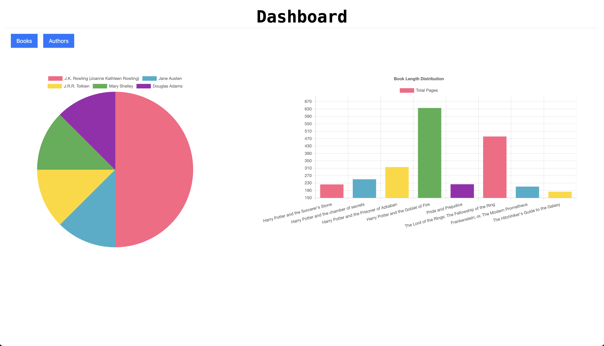
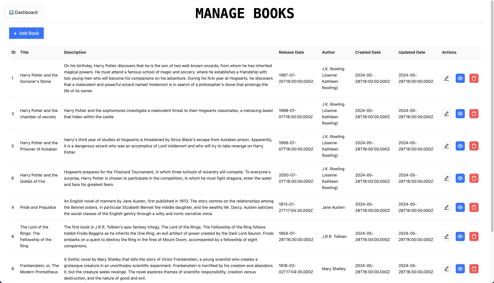
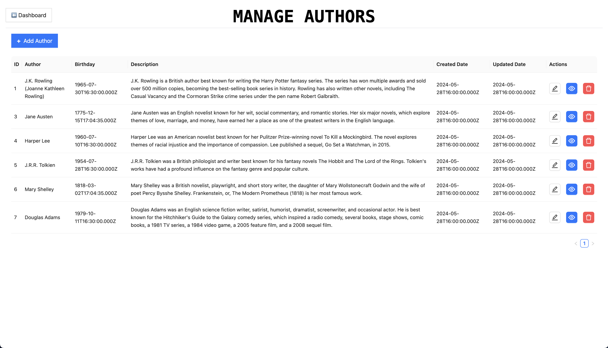

# Learn It Right Way
This project is a full-stack web application built using React js for the frontend, Express js for the backend, and MySQL as the database. The application is designed to demonstrate the implementation of a 3-tier architecture, where the presentation layer (React js), application logic layer (Express js), and data layer (MySQL) are separated into distinct tiers.


## User Interface Screenshots 
#### Dashboard


#### Books


#### Authors


## Connet to RDS instance via SSH
#### To change the ssh key permission:

```bash
chmod 400 your_key.pem
```

#### To start ssh agent:

```bash
eval "$(ssh-agent -s)"  
```

#### To add key to ssh agent:

```bash
ssh-add your_key.pem
```

#### SSH tunneling through a bastion host
```bash
ssh -i /path/to/your/private-key.pem -N -L 3307:<RDS-Endpoint>:3306 ec2-user@<Bastion-Host-IP>
```

## Setting up the Presentation Tier
#### User data script

```bash
#!/bin/bash
# Update package list and install required packages
sudo yum update -y

# Install NGINX
sudo yum install -y nginx

# Start and enable NGINX
sudo systemctl start nginx
sudo systemctl enable nginx

# Define variables
APP_TIER_ALB_URL="http://<internal-application-tier-alb-end-point.region.elb.amazonaws.com>"  # Replace with your actual alb endpoint
NGINX_CONF="/etc/nginx/nginx.conf"
SERVER_NAME="<domain subdomain>"  # Replace with your actual domain name

# Backup existing NGINX configuration
sudo cp $NGINX_CONF ${NGINX_CONF}.bak

# Write new NGINX configuration
sudo tee $NGINX_CONF > /dev/null <<EOL
user nginx;
worker_processes auto;

error_log /var/log/nginx/error.log warn;
pid /run/nginx.pid;

events {
    worker_connections 1024;
}

http {
    include /etc/nginx/mime.types;
    default_type application/octet-stream;

    log_format main '\$remote_addr - \$remote_user [\$time_local] "\$request" '
                    '\$status \$body_bytes_sent "\$http_referer" '
                    '"\$http_user_agent" "\$http_x_forwarded_for"';

    access_log /var/log/nginx/access.log main;

    sendfile on;
    tcp_nopush on;
    tcp_nodelay on;
    keepalive_timeout 65;
    types_hash_max_size 2048;

    include /etc/nginx/conf.d/*.conf;
}
EOL

# Create a separate NGINX configuration file
sudo tee /etc/nginx/conf.d/presentation-tier.conf > /dev/null <<EOL
server {
    listen 80;
    server_name $SERVER_NAME;
    root /usr/share/nginx/html;
    index index.html index.htm;

    #health check
    location /health {
        default_type text/html;
        return 200 "<!DOCTYPE html><p>Health check endpoint</p>\n";
    }

    location / {
        try_files \$uri /index.html;
    }

    location /api/ {
        proxy_pass $APP_TIER_ALB_URL;
        proxy_set_header Host \$host;
        proxy_set_header X-Real-IP \$remote_addr;
        proxy_set_header X-Forwarded-For \$proxy_add_x_forwarded_for;
        proxy_set_header X-Forwarded-Proto \$scheme;
    }
}
EOL


# Restart NGINX to apply the new configuration
sudo systemctl restart nginx

# Install CloudWatch agent
sudo yum install -y amazon-cloudwatch-agent

# Create CloudWatch agent configuration
sudo tee /opt/aws/amazon-cloudwatch-agent/etc/amazon-cloudwatch-agent.json > /dev/null <<EOL
{
  "logs": {
    "logs_collected": {
      "files": {
        "collect_list": [
         {
            "file_path": "/var/log/nginx/access.log",
            "log_group_name": "nginx-logs-frontend",
            "log_stream_name": "{instance_id}-nginx-access",
            "timestamp_format": "%b %d %H:%M:%S"
          },
          {
            "file_path": "/var/log/nginx/error.log",
            "log_group_name": "nginx-logs-frontend",
            "log_stream_name": "{instance_id}-nginx-error",
            "timestamp_format": "%b %d %H:%M:%S"
          },
          {
            "file_path": "/var/log/aws/codedeploy-agent/codedeploy-agent.log",
            "log_group_name": "codedeploy-agent-logs-frontend",
            "log_stream_name": "{instance_id}-agent-log"
          },
          {
            "file_path": "/opt/codedeploy-agent/deployment-root/deployment-logs/codedeploy-agent-deployments.log",
            "log_group_name": "codedeploy-agent-logs-frontend",
            "log_stream_name": "{instance_id}-codedeploy-agent-deployment-log"
          },
          {
            "file_path": "/tmp/codedeploy-agent.update.log",
            "log_group_name": "codedeploy-agent-logs-frontend",
            "log_stream_name": "{instance_id}-codedeploy-agent-updater-log"
          }
        ]
      }
    }
  }
}
EOL

# Start CloudWatch agent
sudo /opt/aws/amazon-cloudwatch-agent/bin/amazon-cloudwatch-agent-ctl -a fetch-config -m ec2 -c file:/opt/aws/amazon-cloudwatch-agent/etc/amazon-cloudwatch-agent.json -s

# Install code deploy agent
sudo yum install ruby -y
sudo yum install wget -y
cd /home/ec2-user
wget https://aws-codedeploy-us-east-1.s3.us-east-1.amazonaws.com/latest/install
chmod +x ./install
sudo ./install auto
sudo systemctl start codedeploy-agent
```

## Setting up the Application Tier
#### User data script

```bash
#!/bin/bash 
# Update package list and install required packages 
sudo yum update -y

# Install Node.js
curl -fsSL https://rpm.nodesource.com/setup_20.x | sudo bash - 
sudo yum install -y nodejs 

# Install PM2 globally 
sudo npm install -g pm2 

# Define the log directory and ensure it exists 
LOG_DIR="/var/log/react-node-mysql-app/backend" 
mkdir -p $LOG_DIR 
sudo chown -R root:root $LOG_DIR

# Create the combined.log file
sudo touch $LOG_DIR/combined.log
sudo chown root:root $LOG_DIR/combined.log  # Set ownership to root

# Create the error.log file
sudo touch $LOG_DIR/error.log
sudo chown root:root $LOG_DIR/error.log  # Set ownership to root

# Ensure PM2 restarts on reboot as root
sudo -u root pm2 startup systemd 
sudo -u root pm2 save 

# Install CloudWatch agent
sudo yum install -y amazon-cloudwatch-agent

# Create CloudWatch agent configuration
sudo tee /opt/aws/amazon-cloudwatch-agent/etc/amazon-cloudwatch-agent.json > /dev/null <<EOL
{
  "logs": {
    "logs_collected": {
      "files": {
        "collect_list": [
          {
            "file_path": "/var/log/react-node-mysql-app/backend/combined.log",
            "log_group_name": "node-app-logs-backend",
            "log_stream_name": "{instance_id}-combined-log",
            "timestamp_format": "%Y-%m-%d %H:%M:%S"
          },
          {
            "file_path": "/var/log/react-node-mysql-app/backend/error.log",
            "log_group_name": "node-app-logs-backend",
            "log_stream_name": "{instance_id}-error-log",
            "timestamp_format": "%Y-%m-%d %H:%M:%S"
          },
          {
            "file_path": "/var/log/aws/codedeploy-agent/codedeploy-agent.log",
            "log_group_name": "codedeploy-agent-logs-backend",
            "log_stream_name": "{instance_id}-agent-log"
          },
          {
            "file_path": "/opt/codedeploy-agent/deployment-root/deployment-logs/codedeploy-agent-deployments.log",
            "log_group_name": "codedeploy-agent-logs-backend",
            "log_stream_name": "{instance_id}-codedeploy-agent-deployment-log"
          },
          {
            "file_path": "/tmp/codedeploy-agent.update.log",
            "log_group_name": "codedeploy-agent-logs-backend",
            "log_stream_name": "{instance_id}-codedeploy-agent-updater-log"
          }
        ]
      }
    }
  }
}
EOL

# Start CloudWatch agent
sudo /opt/aws/amazon-cloudwatch-agent/bin/amazon-cloudwatch-agent-ctl -a fetch-config -m ec2 -c file:/opt/aws/amazon-cloudwatch-agent/etc/amazon-cloudwatch-agent.json -s

# Install code deploy agent
sudo yum install ruby -y
sudo yum install wget -y
cd /home/ec2-user
wget https://aws-codedeploy-us-east-1.s3.us-east-1.amazonaws.com/latest/install
chmod +x ./install
sudo ./install auto
sudo systemctl start codedeploy-agent
```
